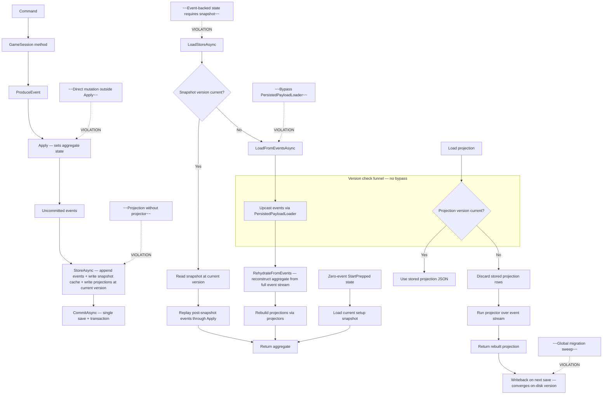

# Event-sourcing integrity doctrine

This doctrine is the primary repository surface for event-sourcing integrity in
the Wild Bunch repo. ADR-0028 is the decision record (why the architecture was
chosen); this doctrine states what must remain true in the implementation and
which failure modes are prohibited. ADR-0028 references this doctrine for the
live canonical flow rather than duplicating it.

## Design Principles

1. **Events are the source of history.** Event-backed session state must be
   reconstructable from the event stream alone. The zero-event `StartPrepped`
   state has no history to replay and uses its current snapshot load path.

2. **Snapshots do not replace event replay.** For event-backed state, a snapshot
   is a performance optimization and a missing or stale snapshot falls back to
   events. Snapshot components remain required to load the current zero-event
   `StartPrepped` state until setup itself is event-backed.

3. **Projections are derived state.** Projections (components, diary days) are
   rebuildable from the event stream. When a projection's stored version does not
   match the current code version, the projection is dropped and rebuilt from
   events — not upcasted. Upcasters are for events only (immutable history that
   cannot be rebuilt).

4. **Upcasters are the version declarations.** There is no hand-edited version
   registry for events. The current version for each event type is derived from
   the count of registered upcasters. To bump a version, you write and register
   an upcaster. The act of bumping IS the act of writing the upcaster.

5. **The load path is a funnel.** There is no code path from persisted rows to
   domain objects that bypasses version checking and upcasting. The serializer's
   deserialize methods are internal; the only public load surface is
   `PersistedPayloadLoader`, which always runs the version check.

6. **Fail closed.** If a version transition is missing an upcaster, the load
   fails rather than returning stale-shape data. If a row is at a future version
   the code doesn't understand, the load fails rather than silently treating it
   as current.

7. **Writeback on next save.** When a session is loaded with an old-version
   projection and then saved (the normal play cycle), the projection is written
   back at current version. Active playthroughs converge to current schema
   naturally. Abandoned playthroughs stay at their old version on disk — no
   global migration sweep.

## Repository rules

1. **All event-backed persisted state must be reconstructable from the event
   stream alone.** If event-backed state cannot be rebuilt through `Apply` or a
   projector, it is a violation. New event-backed state must either be set by an
   `Apply` method from event fields or be derivable by a projector.

2. **Snapshots are shortcut caches for event-backed state.** A missing or
   corrupted event-backed snapshot must not prevent full replay. The zero-event
   `StartPrepped` snapshot exception is current state, not event history, and
   must remain loadable.

3. **Projections are derived state.** Projection tables (components, diary days)
   must have a projector that rebuilds them from the event stream. If a
   projection table exists but no projector can rebuild it, that is a violation.

4. **`Apply` methods must not create projections.** `Apply` sets aggregate state
   from event fields. Projection creation (diary days, log entries, etc.) is a
   read-path concern handled by projectors, not a write-path side effect of
   `Apply`. The command path may create projections as a side effect for
   performance, but the projector must be able to produce the same result from
   events alone.

5. **Command-path state and replay-path state must converge.** Projection state
   must also converge. A projector's output must match what the command path
   produced.

6. **No new persisted state without a replay path.** When adding a new field to a
   projection or a new projection table, the projector that rebuilds it from
   events must be written in the same change. No "we'll add the projector later."

## Canonical Flow Diagram

The following mermaid chart is the canonical CQRS and event-sourcing data flow.
It is the single visual reference for how commands, events, snapshots, and
projections relate.

## Negative Constraints / Common Mistakes

The following are violations of this doctrine. Each describes a pattern that an
agent might introduce and why it is wrong.

1. **Snapshot dependency for event-backed state.** If event-backed state
   cannot load when its snapshot is missing, corrupted, or version-stale, that
   is a violation; full replay must work. This does not apply to the current
   zero-event `StartPrepped` state.

2. **Direct mutation outside `Apply`.** State changes that don't flow through
   `ProduceEvent` → `Apply` are not event-sourced. They won't be reconstructed by
   `RehydrateFromEvents` and will be lost on full replay.

3. **Projection without a projector.** If a projection table exists but no
   projector can rebuild it from the event stream, the projection is not derived
   state — it's a second source of truth. This is a violation.

4. **`Apply` method that creates projections.** `Apply` must set aggregate state
   from event fields only. If `Apply` creates diary days, log entries, or other
   projection rows, it has crossed the write-path/read-path boundary. Projections
   are created by projectors (read path) or by the command path as a performance
   side effect, not by `Apply`.

5. **Bypass `PersistedPayloadLoader`.** Any code path that deserializes persisted
   payloads directly (via `GameSessionJsonSerializer.Deserialize*`) without going
   through `PersistedPayloadLoader` bypasses version checking and upcasting. This
   is a violation of the load funnel.

6. **Version bump without an upcaster.** If an event's JSON shape changes but no
   upcaster is registered, old persisted events will fail to deserialize (or
   deserialize with the wrong shape). The version bump IS the upcaster — no
   upcaster means no version bump means no shape change.

7. **Hand-edited event version registry.** There is no hand-edited registry of
   event versions. Event versions are derived from the count of registered
   upcasters. A hand-edited registry can drift from the actual upcaster chain.

8. **Global migration sweep.** There is no global migration sweep to bring all
   existing playthroughs to current schema. Active playthroughs converge on next
   save; abandoned ones stay at their old version on disk. A sweep is unnecessary
   and operationally risky.

9. **New persisted state without a replay path.** Adding a new field to a
   projection or a new projection table without writing the projector that
   rebuilds it from events in the same change is a violation. The projector must
   land with the state, not "later."

10. **Upcaster that produces wrong shape.** An upcaster must produce the exact
    JSON shape that the current code expects. If the upcaster's output doesn't
    match what the deserializer can read, the load fails. Upcaster correctness is
    verified by `UpcasterCorrectnessTests`.

## Enforcement

- **Build-time:** `UpcasterChainCompletenessTests` asserts every
  `IEventUpcaster` is registered and every event type has a contiguous chain.
- **Test-time:** `FullReplayEqualityTests` asserts that event replay and
  projectors reconstruct complete sessions, including `TravelDiaryDays`;
  `TravelDiaryDayProjectorParityTests` asserts projector parity with the command
  path.
- **Review-time:** For persistence or projection changes, verify replayability,
  projector coverage, payload-version changes, and canonical-flow accuracy.
