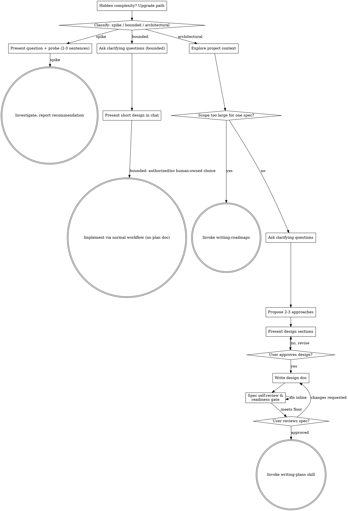

## Provenance

This marketplace-maintained derivative is based on `obra/superpowers` v6.3.0 commit `b36e0829c6d0140e93cfef2ca599b1b07d4a7797` under the MIT License. Upstream source is not vendored; this directory contains the maintained Superpowers+ implementation.

# Brainstorming Ideas Into Designs

Help turn ideas into fully formed designs and specs through natural collaborative dialogue.

Start by classifying how much process the request needs, then work
through your path: understand the context, refine the idea, and make the
smallest decision record that protects the consequential choices.
The ceremony scales with uncertainty and consequence; approval is not a
universal ritual.

<HARD-GATE>
Do NOT invoke any implementation skill, write any code, scaffold any
project, or take implementation action while a consequential product,
canon, privacy, licensing, or authority decision is unresolved. An
architectural design still requires explicit human approval before
implementation. A clear bounded change may proceed from its short design
when the task is already authorized and no human-owned decision remains.
</HARD-GATE>

## Three Paths

Before your first question, classify the request and say the
classification out loud — "this looks bounded, so I'll present a short
design here rather than write a spec" — so your human partner can
override it:

- **Spike** — a feasibility question ("can we...", "is it possible...",
  "quick and dirty is fine") whose output is an answer, not code you
  keep. Present the question and what you'll try in 2-3 sentences, then
  find out as cheaply as correctness allows. No design
  doc, no spec file. Report findings as a recommendation; anything you
  built stays labeled throwaway.
- **Bounded** — a well-scoped change to code that already exists in
  this repo: a new flag, a small endpoint, a one-file fix.
  Understanding the kind of app is not enough — bounded means the flow
  you are changing is already here to read. If there is no existing
  flow to change, the task is not bounded. Ask the clarifying
  questions that matter, present a short design IN CHAT (a few
  sentences to a few short paragraphs). If the task is authorized and
  the design contains no unresolved human-owned choice, proceed through
  the normal implementation workflow; otherwise stop for the specific
  decision. No spec file, no implementation plan document.
- **Architectural** — new projects, new subsystems, changes that
  restructure how components fit together or alter interfaces others
  depend on. Follow the full process: questions, approaches, sectioned
  design, written spec, then the writing-plans skill.

When in doubt between two paths, take the heavier one. The ratchet is
one-way: hidden complexity discovered mid-task upgrades the path —
stop, say so, and step up. Nothing downgrades mid-task.

### Tiny bounded sketch

When the human asks only for one implementation approach to a fully specified,
local, reversible change, answer with the smallest useful design: name the
technical assumption, the proposed edit, and the focused proof. Do not inspect
the repository unless the assumption cannot be stated from supplied context,
and do not invent an approval pause when no human-owned choice remains.

## Anti-Pattern: "Too Simple To Need A Design"

Every path must expose the assumptions that could change the outcome. A
todo list, a single-function utility, or a config change may need only a
two-sentence decision record. Approval is reserved for unresolved
human-owned choices and architectural designs; clear, already-authorized
bounded work does not need a ceremonial pause.

## Red Flags

| Thought | Reality |
|---------|---------|
| "This is too simple to need a design" | Simple means a short decision record, not hidden assumptions. |
| "I'll call it bounded and skip the spec" | Bounded work still needs an observable goal, touched seam, and acceptance check; take the heavier path when the existing flow is not clear. |
| "It's bounded and the design is obvious" | Proceed only when the task is authorized and no human-owned choice remains; stop on a real decision, not for ceremony. |
| "I understand this kind of app, so it's bounded" | Bounded measures the repo, not your familiarity. A new project has no existing flow — it is architectural. |
| "The spike works, so I'll keep the code" | A spike's output is an answer. Keeping the code is a new request — classify it. |
| "It grew, but I'm almost done — no need to re-classify" | Hidden complexity upgrades the path mid-task. Stop and say so. |
| "They approved the spike, so the follow-up change is approved too" | Each task gets its own classification; a human decision is required only when that task contains a human-owned choice. |

## Checklist

Classify first, announce the path, then create a task for each item on
your path and complete them in order.

**Spike:**
1. **Explore project context** — enough to frame the probe
2. **Present question + probe plan** — 2-3 sentences
3. **Investigate** — as cheaply as correctness allows
4. **Report findings** — a recommendation; label anything built as throwaway

**Bounded:**
1. **Explore project context** — check files, docs, recent commits
2. **Ask clarifying questions** — one at a time, the ones that matter
3. **Present short design in chat** — approach, files touched, testing
4. **Resolve the gate if needed** — stop only for a human-owned decision or unresolved consequential choice
5. **Implement** — proceed with the normal development workflow (TDD applies); no plan document

**Architectural:**
1. **Load baseline and local guide** — read this skill's baseline (`references/design-baseline.md`) and the repo's `.agents/runbooks/design.md` before executing the stage checklist.
2. **Explore project context** — check files, docs, recent commits
3. **Ask clarifying questions** — one at a time, understand purpose/constraints/success criteria
4. **Propose 2-3 approaches** — with trade-offs and your recommendation
5. **Present design** — in sections scaled to their complexity, get user approval after each section
6. **Write design doc** — save to `.agents/specs/YYYY-MM-DD-<topic>-design.md` and commit
7. **Spec self-review & readiness gate** — quick inline check for placeholders, contradictions, ambiguity, and scope; then use a reviewer subagent or `handoff-gates` spec-readiness lane. Rate the spec (8/10 floor, 9/10 target) and report the rating in the current handoff without persisting it.
8. **User reviews written spec** — ask the user to review the spec and current rating before proceeding.
9. **Transition to implementation** — invoke writing-plans skill to create implementation plan

## Process Flow

**Terminal states are path-bound.** Architectural: the ONLY skill you
invoke after brainstorming is writing-plans — never frontend-design,
mcp-builder, or any other implementation skill. Bounded: after the short
design is settled and no human-owned choice remains, implementation proceeds
directly through the normal development workflow; no plan document. Spike:
the terminal state is a reported recommendation.

## The Process

The subsections below serve the bounded and architectural paths (a
spike stops after presenting the probe and reporting its recommendation).
Sections from
**Exploring approaches** onward are architectural-path depth — for
bounded work, context plus a few questions plus a short in-chat design
is the whole process.

**Understanding the idea:**

- Check out the current project state first (files, docs, recent commits)
- Before asking detailed questions, assess scope: if the request describes multiple independent subsystems (e.g., "build a platform with chat, file storage, billing, and analytics"), flag this immediately. Don't spend questions refining details of a project that needs to be decomposed first.
- If the project is too large for a single spec, stop and invoke `writing-roadmaps` to build a sequenced roadmap and write Plan 1. Do not brainstorm the whole epic in one pass or continue with detailed design questions until Plan 1 is approved.
- For appropriately-scoped projects, ask questions one at a time to refine the idea
- Prefer multiple choice questions when possible, but open-ended is fine too
- Only one question per message - if a topic needs more exploration, break it into multiple questions
- If a single missing fact blocks the next step, invoke `asking-clarifying-questions` before guessing.
- Focus on understanding: purpose, constraints, success criteria

**Exploring approaches:**

- Propose 2-3 different approaches with trade-offs
- Present options conversationally with your recommendation and reasoning
- Lead with your recommended option and explain why
- YAGNI ruthlessly - remove unnecessary features from every approach and design

**Presenting the design:**

- Once you believe you understand what you're building, present the design
- Scale each section to its complexity: a few sentences if straightforward, up to 200-300 words if nuanced
- Ask after each section whether it looks right so far
- Cover: architecture, components, data flow, error handling, testing
- Be ready to go back and clarify if something doesn't make sense

**Design for isolation and clarity:**

- Break the system into smaller units that each have one clear purpose, communicate through well-defined interfaces, and can be understood and tested independently
- For each unit, you should be able to answer: what does it do, how do you use it, and what does it depend on?
- Can someone understand what a unit does without reading its internals? Can you change the internals without breaking consumers? If not, the boundaries need work.
- Smaller, well-bounded units are also easier for you to work with - you reason better about code you can hold in context at once, and your edits are more reliable when files are focused. When a file grows large, that's often a signal that it's doing too much.

**Working in existing codebases:**

- Explore the current structure before proposing changes. Follow existing patterns.
- Where existing code has problems that affect the work (e.g., a file that's grown too large, unclear boundaries, tangled responsibilities), include targeted improvements as part of the design - the way a good developer improves code they're working in.
- Don't propose unrelated refactoring. Stay focused on what serves the current goal.

## After the Design (architectural path)

**Documentation:**

- Write the validated design (spec) to `.agents/specs/YYYY-MM-DD-<topic>-design.md`
  - (User preferences for spec location override this default)
- Use elements-of-style:writing-clearly-and-concisely skill if available
- Commit the design document to git

**Spec Self-Review:**
After writing the spec document, look at it with fresh eyes:

1. **Placeholder scan:** Any "TBD", "TODO", incomplete sections, or vague requirements? Fix them.
2. **Internal consistency:** Do any sections contradict each other? Does the architecture match the feature descriptions?
3. **Scope check:** Is this focused enough for a single implementation plan, or does it need decomposition?
4. **Ambiguity check:** Could any requirement be interpreted two different ways? If so, pick one and make it explicit.

Fix any issues inline. No need to re-review — just fix and move on.

**User Review Gate:**
After the spec review loop passes, ask the user to review the written spec before proceeding:

> "Spec written and committed to `<path>`. Please review it and let me know if you want to make any changes before we start writing out the implementation plan."

Wait for the user's response. If they request changes, make them and re-run the spec review loop. Only proceed once the user approves.

**Implementation:**

- Invoke the writing-plans skill to create a detailed implementation plan
- Do NOT invoke any other skill. writing-plans is the next step.
