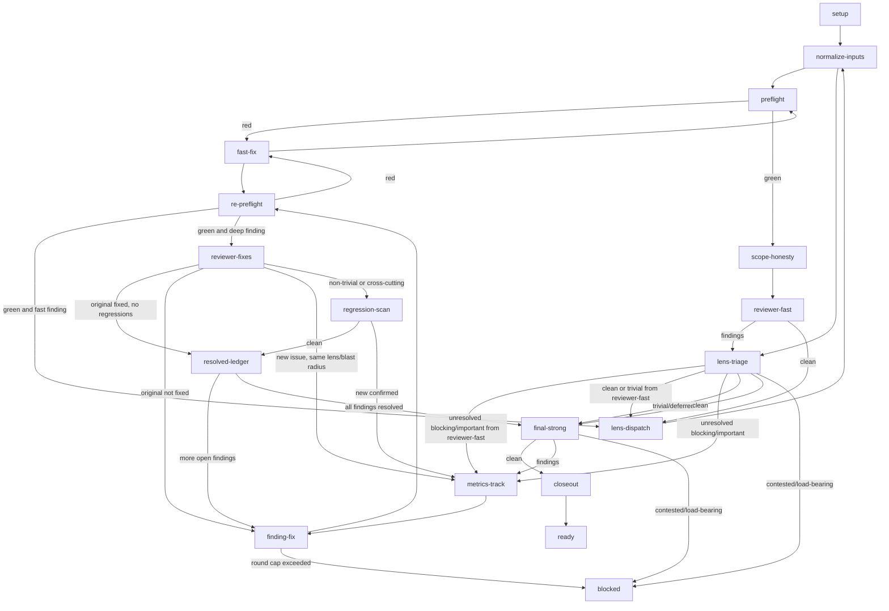
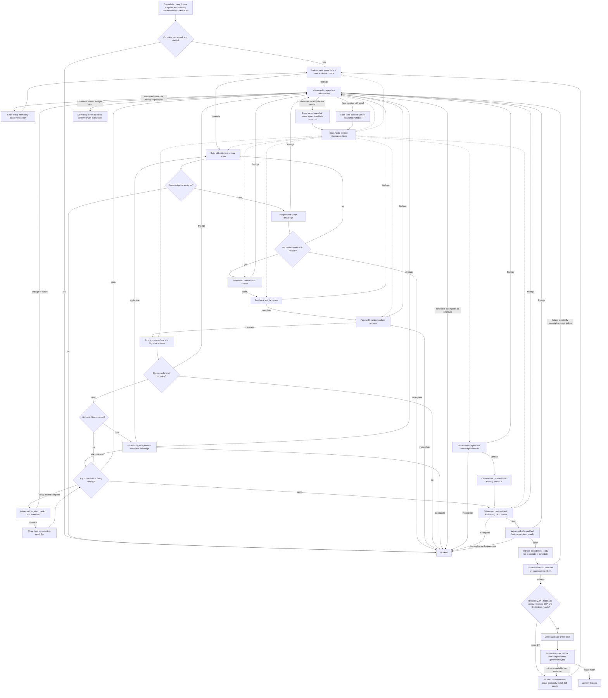

# Iterative review state graph

## Version 1 - legacy assistance

This is the canonical control-flow graph for the version-1 `iterative-review`
skill. The orchestrator follows the graph from `setup` to `ready` or `blocked`,
recording state at every `metrics-track`.

Every `node-*.md` recipe in this directory is **version 1 - legacy
assistance**: the graph routes a useful review sequence, but its terminal
`ready` is loop completion only. Version-1 state has no snapshot binding, no
witness records, and no epoch-scoped evidence, so it cannot produce a
trustworthy-green seal.

Canonical node recipes live in `references/node-*.md` files (one per node in this
directory, named `node-<node>.md`), and the orchestrator uses `next_node.py` to
discover the current node. See `node-next-node.md` for the validation recipe.

## Mermaid graph



## Nodes

|| Node | Actor | Recipe | Purpose |
||---|---|---|---|
|| `setup` | orchestrator | [node-setup.md](node-setup.md) | Prepare the workspace, diff, PR context, and `scan_findings`. |
|| `normalize-inputs` | orchestrator | [node-normalize-inputs.md](node-normalize-inputs.md) | Run `normalize_review_inputs.py --apply` on the scratch directory so every downstream file is plain UTF-8. |
|| `preflight` | consumer CI preflight | [node-preflight.md](node-preflight.md) | Run deterministic pattern checks on the branch before any subagent. |
|| `fast-fix` | orchestrator or implementer | [node-fast-fix.md](node-fast-fix.md) | Fix a deterministic preflight finding; trivial items the orchestrator can fix, mechanical items an `implementer`. |
|| `scope-honesty` | orchestrator | [node-scope-honesty.md](node-scope-honesty.md) | Compare the diff to the plan, spec, PR body, and linked issues. Record or fix drift. |
|| `reviewer-fast` | `reviewer-fast` subagent | [node-reviewer-fast.md](node-reviewer-fast.md) | Cheap pre-lens that catches mechanical, surface-level issues before deep lens dispatch. |
|| `lens-dispatch` | parallel subagents | [node-lens-dispatch.md](node-lens-dispatch.md) | Dispatch the matching deep lens reviewers. |
|| `lens-triage` | orchestrator | [node-lens-triage.md](node-lens-triage.md) | Decide the fate of each lens finding: `blocking/important` findings enter the fast fix loop unless resolved as false positives at triage, `trivial/deferred` findings are left for `final-strong`, and `contested/load-bearing` findings are `blocked`. If no findings, proceed to `final-strong`. |
|| `metrics-track` | orchestrator | [node-metrics-track.md](node-metrics-track.md) | Record the finding, the node that discovered it, the round number, the node where it resolves, and the `regression_class`. This node does not block. |
|| `finding-fix` | `implementer` subagent | [node-finding-fix.md](node-finding-fix.md) | Resolve one finding with the lens's checklist and a concrete brief, then commit. |
|| `re-preflight` | consumer canonical CI check | [node-re-preflight.md](node-re-preflight.md) | Re-run the deterministic checks on the post-fix range. |
|| `reviewer-fixes` | `reviewer-fixes` subagent | [node-reviewer-fixes.md](node-reviewer-fixes.md) | Cheap lens-aware re-review of the fix blast radius. Verifies the original finding and applies the originating lens's `## Checklist` to the changed files only. |
|| `regression-scan` | `reviewer-strong` on the touched area | [node-regression-scan.md](node-regression-scan.md) | For non-trivial or cross-cutting fixes, confirm and classify any new issue the fix introduced. |
|| `resolved-ledger` | orchestrator | [node-resolved-ledger.md](node-resolved-ledger.md) | Bookkeeping node that records resolutions via `record_resolution.py` into `resolutions.jsonl` and `compile_metrics.py` generates `review-metrics.json`. When the queue is empty, runs `resolved_ledger.py --apply` to produce `review-log-resolved-ledger.md` before `final-strong`. |
|| `final-strong` | `reviewer-strong` | [node-final-strong.md](node-final-strong.md) | One whole-branch pass after all queued findings are resolved. Requires a clean `review-metrics.json` and `review-log-resolved-ledger.md` when the `resolved-ledger` node was visited (i.e., when fixes were made). If all `blocking/important` findings were resolved at `lens-triage` and no `resolved-ledger` was produced, `reviewer-strong` still proceeds. `reviewer-strong` refuses if unresolved `important`/`blocking` findings or regressions remain. Confirms no remaining gaps, contradictions, or design issues. |
|| `closeout` | orchestrator | [node-closeout.md](node-closeout.md) | After `reviewer-strong: clean`, remove completed planning artifacts per the consumer's completion custody if the PR closes them. |
|| `ready` | orchestrator | [node-ready.md](node-ready.md) | Final `ci --check`; flip the PR from draft to ready; wait for remote CI to pass. |
|| `blocked` | orchestrator | [node-blocked.md](node-blocked.md) | Human escalation for contested or load-bearing findings the orchestrator cannot resolve. |

## Edges

|| From | To | Condition |
||---|---|---|
|| `setup` | `normalize-inputs` | Always. |
|| `normalize-inputs` | `preflight` | Always. |
|| `preflight` | `fast-fix` | Any deterministic finding from `review-preflight`. |
|| `fast-fix` | `preflight` | Always; re-run preflight after the fix. |
|| `preflight` | `scope-honesty` | `ci --check` passes. |
|| `scope-honesty` | `reviewer-fast` | Drift corrected or no drift. |
|| `reviewer-fast` | `lens-triage` | `reviewer-fast` reported findings. |
|| `reviewer-fast` | `lens-dispatch` | `reviewer-fast: clean`. |
|| `lens-triage` | `metrics-track` | `blocking/important` findings that need a fix before the next dispatch or final. |
|| `lens-triage` | `lens-dispatch` | When the previous node was `reviewer-fast` and all remaining findings are `trivial/deferred` or none. |
|| `lens-triage` | `final-strong` | When the previous node was `lens-dispatch` and all remaining findings are `trivial/deferred` or none. |
|| `lens-triage` | `blocked` | A finding is `contested`, `tool-blocked`, or `load-bearing`. |
|| `metrics-track` | `finding-fix` | Always; choose the next finding to fix. |
|| `finding-fix` | `re-preflight` | Fix is committed. |
|| `re-preflight` | `fast-fix` | A new deterministic issue appears. |
|| `re-preflight` | `lens-dispatch` | `ci --check` passes and the finding being fixed originated from `reviewer-fast`. |
|| `re-preflight` | `reviewer-fixes` | `ci --check` passes and the finding being fixed originated from a deep lens. |
|| `lens-dispatch` | `normalize-inputs` | All deep lens logs are available. |
|| `normalize-inputs` | `lens-triage` | UTF-8 backstop has run on the scratch directory. |
|| `reviewer-fixes` | `resolved-ledger` | The original finding is fixed and `reviewer-fixes` is clean. |
|| `reviewer-fixes` | `finding-fix` | The original finding is not fixed. |
|| `reviewer-fixes` | `metrics-track` | `reviewer-fixes` finds a new same-lens/blast-radius issue. |
|| `reviewer-fixes` | `regression-scan` | The fix is non-trivial. |
|| `regression-scan` | `resolved-ledger` | `reviewer-strong` on the touched area is clean. |
|| `regression-scan` | `metrics-track` | `reviewer-strong` on the touched area confirms a new issue. |
|| `resolved-ledger` | `finding-fix` | More findings remain in the queue. |
|| `resolved-ledger` | `final-strong` | All findings are resolved. |
|| `final-strong` | `closeout` | `reviewer-strong` reports `reviewer-strong: clean`. |
|| `final-strong` | `metrics-track` | `reviewer-strong` reports findings. |
|| `final-strong` | `blocked` | A finding is contested or load-bearing. |
|| `closeout` | `ready` | Completed planning artifacts are removed and the local tree passes the consumer's canonical validation. |

## Round counting

A "round" is one complete traversal through `lens-dispatch` or `final-strong` that produces findings. `lens-triage`, `reviewer-fixes`, and `resolved-ledger` are not rounds because they are cheap or bookkeeping nodes. The first `lens-dispatch` is round 1. The first `final-strong` is round 2. A `regression-scan` or `final-strong` that confirms a new issue starts a new round at `metrics-track`.

## `review-metrics.json` schema

```json
{
  "pr": {
    "branch": "feat/example",
    "base": "main",
    "head_sha": "..."
  },
  "findings_by_node": {
    "preflight": 0,
    "lens-dispatch": 0,
    "lens-security": 0,
    "lens-skills": 0,
    "lens-marketplace": 0,
    "lens-plans": 0,
    "lens-mesh": 0,
    "lens-scripts": 0,
    "strong-review": 0,
    "regression-scan": 0
  },
  "rounds_per_finding": [
    {
      "finding_id": "F1",
      "lens": "reviewer-skills",
      "discovered_at_node": "lens-dispatch",
      "discovered_at_round": 1,
      "resolved_at_node": "reviewer-fixes",
      "resolved_at_round": 2,
      "severity": "important"
    }
  ],
  "regressions": [
    {
      "fix_for": "F1",
      "new_finding": "F2",
      "discovered_at_node": "regression-scan",
      "discovered_at_round": 2,
      "lens": "reviewer-security",
      "regression_class": "outside-blast-radius",
      "severity": "blocking"
    }
  ],
  "total_rounds": 2,
  "total_reviewer_subagent_dispatches": 4,
  "devin_auto_review_invocations": 1
}
```

## `review-log-reviewer-fast.md`

This off-repo log is now produced by the `reviewer-fast` pre-lens instead of the
orchestrator. The `reviewer-fast` profile writes it and ends with
`reviewer-fast: clean` or `reviewer-fast: N issue(s)`. The deep reviewers listed
in `lenses.jsonl` receive the log as part of their input package.

## Version 2 - target fail-closed graph (roadmap, not yet the entrypoint)

The version-2 kernel under `scripts/review_core/` plus `scripts/reviewctl.py`
implements the fail-closed target graph below. It is experimental: the live
witness sources it composes arrive in later roadmap plans, and the version-1
workflow above remains the user entrypoint until cutover.

The following are required evidence gates in version 2, not optional steps:

- trusted snapshot freeze and refresh (`freeze-review-input`,
  `refresh-review-input`) - the only way in, bound to an exact head/tree;
- authority manifest and authority content, hash-bound at freeze;
- both impact maps (semantic and contract) for the current epoch;
- the independent scope challenge over the map union;
- tiered reviewer attestations (fast, focused, strong) with launch and
  completion witnesses;
- role-qualified `final-strong` blind final and closure audit on the epoch;
- hosted CI verified on the exact reviewed SHA via the three-phase
  `mark-ready-for-ci` intent, remote-transition witness, and CI candidate;
- the presentation recheck (`present`, Plan 6) that re-fetches remote identity
  and re-verifies the witness chain before emitting `reviewed-green`.



A harness lacking the capability floor (see `harness-capability-floor.md`)
terminates at `inert`: the CLI detects the runtime at intake and refuses
mutations rather than degrading to assertion-based evidence.

### Scope-to-reasoning ladder

Review capability must rise as the review aperture widens. The assigned tier is
the maximum row that applies; repo or domain law may raise a floor but never
lower it. A cheaper or lower-reasoning result may discover findings but cannot
satisfy a higher-tier obligation.

| Input | Required tier |
| --- | --- |
| `hunk` or `file` scope | `fast` |
| `surface` scope | `focused` |
| `cross-surface` scope | `strong` |
| `whole-pr` scope | `final-strong` |
| `low` risk | `fast` |
| `medium` risk | `focused` |
| `high` risk | `strong` |
| security, authorization, privacy, secrets, irreversible data loss, concurrency/recovery, migration/rollback, public compatibility, or source-custody consequence | at least `strong` |

| Tier | Review aperture | Minimum reasoning floor |
| --- | --- | --- |
| `fast` | mechanical hunk/file checks | `low` |
| `focused` | one finding, file group, or bounded surface | `standard` |
| `strong` | component, cross-file behavior, security, architecture, or cross-surface interaction | `high` |
| `final-strong` | whole pull request, cross-lens synthesis, and green challenge | `final-strong` |

The ladder is monotonic during each outward review ascent: fast precedes
focused and strong, which precede the blind final and closure audit. A fix
narrows the aperture and may return to a focused re-review; afterward every
invalidated broader tier repeats in ascending order. A lower tier never
replaces a failed, unavailable, or disagreeing higher tier.

See `trustworthy-green-invariants.md` for the green predicates, version
authority, evidence-binding rules, and closure semantics these gates enforce.
