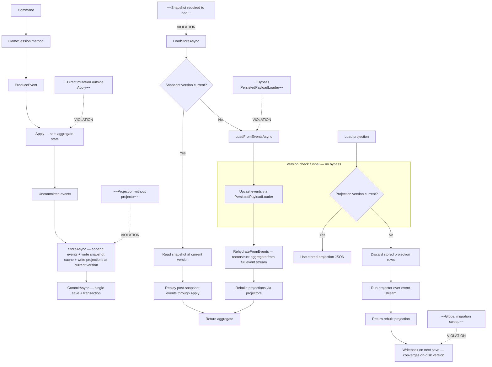

# Event Sourcing Integrity — Plan A: Policy and Audit Implementation Plan

> **For agentic workers:** REQUIRED SUB-SKILL: Use superpowers:subagent-driven-development (recommended) or superpowers:executing-plans to implement this plan task-by-task. Steps use checkbox (`- [ ]`) syntax for tracking.

**Goal:** Establish the event sourcing integrity policy surface (policy doc, mermaid canonical-flow diagram, negative constraints, skill routing, guardrails/review-guide updates) and audit all persisted state for replayability.

**Architecture:** This plan is documentation and verification only — no production code changes. The policy doc becomes the primary operational surface for event sourcing integrity, referenced by architecture guardrails, the project doctrine skill, and the code review guide. The audit verifies that every persisted component is reconstructable from the event stream, identifying violations for Plan B to fix.

**Tech Stack:** Markdown, Mermaid diagrams, Python (index mesh generation)

## Global Constraints

- Plans go in `.agents/superpowers/plans/` per `.agents/docs/artifact-policy.md`.
- Authored docs live in `.agents/docs/` per repo root `AGENTS.md`.
- The policy doc is the primary operational surface; ADR-0028 is the decision record (why), the policy doc is the operational guidance (what to do/not do).
- INDEX.md files must be regenerated after adding files (via `python scripts/generate_index_mesh.py`).
- No production code changes in this plan.

---

### Task 1: Create the event sourcing integrity policy document

**Files:**
- Create: `.agents/docs/event-sourcing-integrity-policy.md`

**Interfaces:**
- Produces: `.agents/docs/event-sourcing-integrity-policy.md` — referenced by Task 2 (guardrails), Task 3 (doctrine skill), Task 4 (review guide), and by Plans B and C.

- [ ] **Step 1: Create the policy document**

Create `.agents/docs/event-sourcing-integrity-policy.md` with the following exact content:

```markdown
# Event Sourcing Integrity Policy

This policy is the primary operational surface for event sourcing integrity in
the Wild Bunch repo. ADR-0028 is the decision record (why the architecture was
chosen); this policy is the operational guidance (what an agent must do and must
not do when working in this architecture). ADR-0028 references this policy for
the live canonical flow rather than duplicating it.

## Design Principles

1. **Events are the source of truth.** Every piece of persisted state must be
   reconstructable from the event stream alone. Snapshots and projections are
   shortcut caches — they must never be operationally required to load a session.

2. **Snapshots are shortcut caches, not part of the replay contract.** A snapshot
   is a performance optimization. The system must function correctly without it.
   If a snapshot is missing or its shape is wrong, the session loads from events.

3. **Projections are derived state.** Projections (components, diary days) are
   rebuildable from the event stream. When a projection's stored version does not
   match the current code version, the projection is dropped and rebuilt from
   events — not upcasted. Upcasters are for events only (immutable history that
   cannot be rebuilt).

4. **Upcasters are the version declarations.** There is no hand-edited version
   registry for events. The current version for each event type is derived from
   the count of registered upcasters. To bump a version, you write and register
   an upcaster. The act of bumping IS the act of writing the upcaster.

5. **The load path is a funnel.** There is no code path from persisted rows to
   domain objects that bypasses version checking and upcasting. The serializer's
   deserialize methods are internal; the only public load surface is
   `PersistedPayloadLoader`, which always runs the version check.

6. **Fail closed.** If a version transition is missing an upcaster, the load
   fails rather than returning stale-shape data. If a row is at a future version
   the code doesn't understand, the load fails rather than silently treating it
   as current.

7. **Writeback on next save.** When a session is loaded with an old-version
   projection and then saved (the normal play cycle), the projection is written
   back at current version. Active playthroughs converge to current schema
   naturally. Abandoned playthroughs stay at their old version on disk — no
   global migration sweep.

## Policy Rules

1. **All persisted state must be reconstructable from the event stream alone.**
   If a piece of state cannot be rebuilt by replaying events through `Apply` or
   through a projector, it is a violation. New state that needs persistence must
   either (a) be set by an `Apply` method from event fields, or (b) be derivable
   by a projector from the event stream.

2. **Snapshots are shortcut caches.** They must never be the only path to load a
   session. The system must function correctly with an empty snapshot table. A
   missing or corrupted snapshot must not prevent session load.

3. **Projections are derived state.** Projection tables (components, diary days)
   must have a projector that rebuilds them from the event stream. If a
   projection table exists but no projector can rebuild it, that is a violation.

4. **`Apply` methods must not create projections.** `Apply` sets aggregate state
   from event fields. Projection creation (diary days, log entries, etc.) is a
   read-path concern handled by projectors, not a write-path side effect of
   `Apply`. The command path may create projections as a side effect for
   performance, but the projector must be able to produce the same result from
   events alone.

5. **Command-path state and replay-path state must converge.** Projection state
   must also converge. A projector's output must match what the command path
   produced.

6. **No new persisted state without a replay path.** When adding a new field to a
   projection or a new projection table, the projector that rebuilds it from
   events must be written in the same change. No "we'll add the projector later."

## Canonical Flow Diagram

The following mermaid chart shows the canonical CQRS + event sourcing data flow.
This is the **target flow** that the system must conform to — not the current
(pre-policy) state. The chart is the single visual reference for how commands,
events, snapshots, and projections relate.



## Negative Constraints / Common Mistakes

The following are violations of this policy. Each describes a pattern that an
agent might introduce and why it is wrong.

1. **Snapshot required to load.** If the load path fails when the snapshot is
   missing, corrupted, or version-stale, that is a violation. The snapshot is a
   shortcut cache; the full replay path must always work.

2. **Direct mutation outside `Apply`.** State changes that don't flow through
   `ProduceEvent` → `Apply` are not event-sourced. They won't be reconstructed by
   `RehydrateFromEvents` and will be lost on full replay.

3. **Projection without a projector.** If a projection table exists but no
   projector can rebuild it from the event stream, the projection is not derived
   state — it's a second source of truth. This is a violation.

4. **`Apply` method that creates projections.** `Apply` must set aggregate state
   from event fields only. If `Apply` creates diary days, log entries, or other
   projection rows, it has crossed the write-path/read-path boundary. Projections
   are created by projectors (read path) or by the command path as a performance
   side effect, not by `Apply`.

5. **Bypass `PersistedPayloadLoader`.** Any code path that deserializes persisted
   payloads directly (via `GameSessionJsonSerializer.Deserialize*`) without going
   through `PersistedPayloadLoader` bypasses version checking and upcasting. This
   is a violation of the load funnel.

6. **Version bump without an upcaster.** If an event's JSON shape changes but no
   upcaster is registered, old persisted events will fail to deserialize (or
   deserialize with the wrong shape). The version bump IS the upcaster — no
   upcaster means no version bump means no shape change.

7. **Hand-edited event version registry.** There is no hand-edited registry of
   event versions. Event versions are derived from the count of registered
   upcasters. A hand-edited registry can drift from the actual upcaster chain.

8. **Global migration sweep.** There is no global migration sweep to bring all
   existing playthroughs to current schema. Active playthroughs converge on next
   save; abandoned ones stay at their old version on disk. A sweep is unnecessary
   and operationally risky.

9. **New persisted state without a replay path.** Adding a new field to a
   projection or a new projection table without writing the projector that
   rebuilds it from events in the same change is a violation. The projector must
   land with the state, not "later."

10. **Upcaster that produces wrong shape.** An upcaster must produce the exact
    JSON shape that the current code expects. If the upcaster's output doesn't
    match what the deserializer can read, the load fails. Upcaster correctness is
    verified by the upcaster correctness tests (Plan C, Part 2e test 2).

## Skill Routing

When working in event sourcing, persistence, or projection code:

- Invoke `/wild-bunch-dotnet-architecture` for GameSession live-play flows,
  application orchestration, infrastructure persistence, CQRS/read models,
  event-stream plus snapshot-cache state, and framework leakage guardrails.
- Invoke `/wild-bunch-domain-modeling` for DDD tactical modeling, GameSession
  boundaries, and domain event design.
- Invoke `/cqrs-event-sourcing` for command/query separation, events as source of
  truth, and projection patterns.
- Invoke `/event-driven-architecture` for domain events and projections.
- Invoke `/ddd` for aggregate root, value object, and domain event modeling.

## Enforcement

- **Build-time:** The upcaster chain completeness test (Plan C) asserts every
  `IEventUpcaster` is registered and every event type has a contiguous chain.
- **Test-time:** The full replay equality test (Plan B) asserts that
  `RehydrateFromEvents` + projectors reconstruct the complete session, including
  `TravelDiaryDays`. The projection rebuild parity test (Plan B/C) asserts
  projector output matches command-path output.
- **Review-time:** The code review guide (updated by this policy) includes
  event-sourcing-integrity review checks. Reviewers must verify replayability,
  projector existence, version bumps, and chart-staleness for any PR touching
  persistence or projections.
- **Branch protection:** Branch protection on `main` (Part 3) makes the
  build-time and test-time enforcement blocking, not advisory.
```

- [ ] **Step 2: Verify the file was created**

Run: `test -f .agents/docs/event-sourcing-integrity-policy.md && echo "OK"`
Expected: `OK`

- [ ] **Step 3: Commit**

```bash
git add .agents/docs/event-sourcing-integrity-policy.md
git commit -m "Add event sourcing integrity policy document

Establishes the primary operational surface for event sourcing integrity:
design principles, policy rules, canonical flow mermaid diagram with negative
constraint paths, 10 negative constraints/common mistakes, skill routing, and
enforcement mechanisms. Referenced by architecture guardrails, project doctrine
skill, and code review guide (updated in subsequent tasks)."
```

---

### Task 2: Update architecture guardrails to reference the policy

**Files:**
- Modify: `.agents/docs/architecture-guardrails.md` (line 40 area, the "Event Sourcing" subsection)

**Interfaces:**
- Consumes: `.agents/docs/event-sourcing-integrity-policy.md` (from Task 1)
- Produces: Updated guardrails that route persistence/event-sourcing work to the policy doc.

- [ ] **Step 1: Read the current guardrails event sourcing section**

Read `.agents/docs/architecture-guardrails.md` and locate the "### Event Sourcing" subsection (around line 38-44). The current text says:

```markdown
### Event Sourcing
- Gameplay mutations produce typed domain events (`IDomainEvent`), apply them through `Apply(EventType)` methods, and record uncommitted events via `ProduceEvent`.
- The repository appends typed events to the event stream and keeps JSON component snapshots as cache. Snapshots are cache, not the source of truth — the event stream is the source of history.
- `Apply` methods are the event-sourced mutation path. They must be pure: no external calls, no time-dependent logic, no random. They set state from the event's fields.
- Command-path state and replay-path state must converge. This is verified by parity tests (`RehydrateFromEvents_Replay_Matches_Command_Path_State`). If a command mutates state directly, the corresponding `Apply` method must produce the same state from the event.
- Do not add direct state mutations outside the event-sourced route. If you need to change state, produce an event and let `Apply` do the work.
- Do not introduce a separate event-store interface, broker, EventStoreDB, or normalized live-session table split unless the issue explicitly scopes it.
```

- [ ] **Step 2: Add a reference to the policy doc at the end of the Event Sourcing subsection**

Add this line after the last bullet in the "### Event Sourcing" subsection (after the "Do not introduce a separate event-store interface..." line):

```markdown
- **See [`.agents/docs/event-sourcing-integrity-policy.md`](event-sourcing-integrity-policy.md)** for the full event sourcing integrity policy: design principles, canonical flow diagram, negative constraints, projection rebuild rules, and version enforcement. That policy is the primary operational surface; this guardrails section is the summary.
```

- [ ] **Step 3: Commit**

```bash
git add .agents/docs/architecture-guardrails.md
git commit -m "Reference event sourcing integrity policy from architecture guardrails"
```

---

### Task 3: Update wild-bunch-project-doctrine skill to route to the policy

**Files:**
- Modify: `.agents/skills/wild-bunch-project-doctrine/references/policy-references.md` (add policy reference)

**Interfaces:**
- Consumes: `.agents/docs/event-sourcing-integrity-policy.md` (from Task 1)
- Produces: Doctrine skill routes persistence/event-sourcing work to the policy doc.

- [ ] **Step 1: Add the policy reference to the policy-references file**

In `.agents/skills/wild-bunch-project-doctrine/references/policy-references.md`, add this line after the `architecture-guardrails.md` entry (after the line that starts with `- **\`.agents/docs/architecture-guardrails.md\`**`):

```markdown
- **`.agents/docs/event-sourcing-integrity-policy.md`** — Use when working with event sourcing, persistence load/write paths, projections, snapshot cache, or payload versioning. The primary operational surface for event sourcing integrity: design principles, policy rules, canonical flow diagram, negative constraints, skill routing, and enforcement mechanisms.
```

- [ ] **Step 2: Commit**

```bash
git add .agents/skills/wild-bunch-project-doctrine/references/policy-references.md
git commit -m "Route event sourcing integrity policy from project doctrine skill"
```

---

### Task 4: Update code review guide with event-sourcing-integrity review checks

**Files:**
- Modify: `.agents/docs/guides/code-review-guide.md` (add a new subsection under Architecture Review)

**Interfaces:**
- Consumes: `.agents/docs/event-sourcing-integrity-policy.md` (from Task 1)
- Produces: Review guide includes ES-integrity checks for PRs touching persistence or projections.

- [ ] **Step 1: Read the current Architecture Review section**

Read `.agents/docs/guides/code-review-guide.md` and locate "## 2. Architecture Review" (around line 25-38). The section ends with the ADR freshness check paragraph.

- [ ] **Step 2: Add an event-sourcing-integrity review subsection**

Add the following new subsection after the ADR freshness check paragraph (after the line starting with "**ADR freshness check:**"):

```markdown
### Event Sourcing Integrity Review

When reviewing work that touches persistence, projections, event types, `Apply` methods, or the load/write paths, reviewers must check the following against [`.agents/docs/event-sourcing-integrity-policy.md`](../event-sourcing-integrity-policy.md):

- **Replayability:** Is every piece of new or modified persisted state reconstructable from the event stream alone? If a new field is added to a projection, is there a projector that rebuilds it from events? If a new `Apply` method is added, does `RehydrateFromEvents` produce the same state?
- **Projector existence:** If a new projection table or projection field is added, does the PR include the projector that rebuilds it from events? No "we'll add the projector later."
- **Version bumps:** If an event's JSON shape changed, is there a registered upcaster? If a projection's shape changed, is the projection version bumped? Shape change without version bump is a violation.
- **Chart staleness:** If the canonical flow diagram in the policy doc no longer matches the system (new load path, new projection type, changed snapshot behavior), the chart must be updated in the same PR.
- **Load funnel:** Does any new code path deserialize persisted payloads directly, bypassing `PersistedPayloadLoader`? If so, that is a violation.
- **`Apply` purity:** Do any new or modified `Apply` methods create projections, make external calls, or depend on time/random? `Apply` must be pure and set aggregate state from event fields only.
```

- [ ] **Step 3: Commit**

```bash
git add .agents/docs/guides/code-review-guide.md
git commit -m "Add event sourcing integrity review checks to code review guide"
```

---

### Task 5: Update ADR-0028 to reference the policy doc

**Files:**
- Modify: `docs/adr/ADR-0028-onion-ddd-cqrs-event-sourcing-and-projections-posture.md` (add reference in "Related Stable Source Surfaces" section)

**Interfaces:**
- Consumes: `.agents/docs/event-sourcing-integrity-policy.md` (from Task 1)
- Produces: ADR-0028 references the policy doc as the live canonical flow source.

- [ ] **Step 1: Read the current "Related Stable Source Surfaces" section**

Read `docs/adr/ADR-0028-onion-ddd-cqrs-event-sourcing-and-projections-posture.md` and locate the "## Related Stable Source Surfaces" section (around line 184-193).

- [ ] **Step 2: Add the policy doc reference**

Add this line to the "Related Stable Source Surfaces" list (after the `.agents/docs/architecture-hygiene.md` line):

```markdown
- `.agents/docs/event-sourcing-integrity-policy.md` (the primary operational surface for event sourcing integrity — canonical flow, policy rules, negative constraints, and enforcement)
```

- [ ] **Step 3: Update the ADR freshness table**

In `docs/adr/INDEX.md`, update the "Last checked" timestamp for ADR-0028 to today's date (the date this task is executed). This records that ADR-0028 was verified fresh against current source in this pass.

- [ ] **Step 4: Commit**

```bash
git add docs/adr/ADR-0028-onion-ddd-cqrs-event-sourcing-and-projections-posture.md docs/adr/INDEX.md
git commit -m "Reference event sourcing integrity policy from ADR-0028"
```

---

### Task 6: Audit all persisted state for replayability

**Files:**
- No file changes — this is a verification task that produces findings.
- If violations are found beyond `TravelDiaryDays`, document them in the plan's SDD session report.

**Interfaces:**
- Consumes: `src/WildBunch.Persistence/GameSessions/GameSessionComponentNames.cs` (16 component names), `src/WildBunch.Persistence/GameSessions/GameSessionEntity.cs` (entity fields), `src/WildBunch.Domain/Game/GameSession.cs` (Apply methods), `src/WildBunch.Domain/Game/GameSessionEventReplay.cs` (RehydrateFromEvents)

- [ ] **Step 1: Audit each component name against Apply methods**

Read `src/WildBunch.Persistence/GameSessions/GameSessionComponentNames.cs` and enumerate all 16 component names:

1. `Player` — set by `Apply(GameStarted)` / `Apply(PlayerSetupCompleted)` / `Apply(StoreItemPurchased)` etc. ✓
2. `World` — set by `Apply(WorldGenerated)`. ✓
3. `CaseFile` — set by `Apply(CaseFileGenerated)` / `Apply(SheriffTurnInSettled)` etc. ✓
4. `Clock` — set by `Apply(GameStarted)` / `Apply(TravelDayAdvanced)` etc. ✓
5. `PursuitState` — set by `Apply(JourneyStarted)` / `Apply(TravelDayAdvanced)` etc. ✓
6. `Setup` — set by `Apply(GameStarted)` / `Apply(PlayerSetupCompleted)`. ✓
7. `SaltSource` — set by `Apply(GameStarted)`. ✓
8. `TownVisitState` — set by `Apply(TownActionContextEntered)` etc. ✓
9. `Journey` — set by `Apply(JourneyStarted/TravelDayAdvanced/TrailEventApplied/JourneyEncounterResolved/JourneyCompleted/JourneyArrivalAcknowledged)`. ✓
10. `CompletedJourneyHistory` — set by `Apply(JourneyArrivalAcknowledged)`. ✓
11. `WantedSuspectPresenceLedger` — set by `Apply` methods for bounty/saloon events. ✓
12. `CurrentActionContext` — set by `Apply(TownActionContextEntered)`. ✓
13. `PendingDevTravelOverride` — set by `Apply(DevTravelOverrideForced/Cleared/Consumed)`. ✓
14. `PendingDevSaloonOverride` — set by `Apply(DevSaloonOverrideForced/Cleared/Consumed)`. ✓
15. `DevLayoutSalts` — set by `Apply(DevLayoutSaltsForced)`. ✓
16. `UnrelatedCriminalLedger` — rebuilt from `CaseFileGenerated` + gang roster; `RestoreBountyLoopState` handles snapshot restore, `Apply(SheriffTurnInSettled)` / `Apply(UnrelatedCriminalTurnInSettled)` handle event replay. ✓

For each component, verify by searching for `Apply(` methods that set the corresponding domain field. Use:

```bash
grep -rn "Apply.*(" src/WildBunch.Domain/Game/ --include="*.cs" | grep -i "<component_name>"
```

If any component has no `Apply` method that sets it and no projector that rebuilds it, it is a violation. Document it.

- [ ] **Step 2: Audit GameSessionEntity scalar fields**

Read `src/WildBunch.Persistence/GameSessions/GameSessionEntity.cs`. The scalar fields are:

- `Id` — set by repository on create, not domain state. ✓ (metadata)
- `CreatedAtUtc` — set by repository on create. ✓ (metadata)
- `UpdatedAtUtc` — set by repository on save. ✓ (metadata)
- `Status` — set by `Apply(GameStarted)` / `Apply(PlaythroughArchived)`. ✓
- `GameDifficulty` — set by `Apply(GameStarted)`. ✓
- `SeedCode` — set by `Apply(GameStarted)` / `Apply(PlayerSetupCompleted)`. ✓
- `SchemaVersion` — set by repository, not domain state. ✓ (metadata)
- `StreamVersion` — set by repository for optimistic concurrency. ✓ (metadata)
- `SnapshotVersion` — set by repository for snapshot tracking. ✓ (metadata)

All scalar fields are either domain state set by `Apply` methods or repository metadata. No violations.

- [ ] **Step 3: Audit TravelDiaryDays (the known violation)**

Read `src/WildBunch.Domain/Game/GameSession.cs` and search for `TravelDiaryDay` references. Confirm:

- `JourneyLoop.Apply(JourneyStarted)` clears `_travelDiaryDays`.
- No `Apply` method creates `TravelDiaryDayState` entries.
- `TravelDiaryDayState` rows are created by `JourneyLoop.AppendTravelDiaryDay` / `PersistLatestTravelDiaryDay` (command-path side effect).
- `RehydrateFromEvents` produces empty `TravelDiaryDays`.

This is the known violation. It is fixed by Plan B (Task: `TravelDiaryDayProjector`). Document this finding.

- [ ] **Step 4: Document audit findings**

Write the audit findings in the SDD session report (or PR body if executing inline). The expected findings are:

- 16 component names: all replayable via `Apply` methods. No violations.
- 9 entity scalar fields: all either domain state set by `Apply` or repository metadata. No violations.
- `TravelDiaryDays`: known violation — not reconstructable from events. Fixed by Plan B.

If any additional violations are found, document them and add them to Plan B's scope.

- [ ] **Step 5: Commit the audit findings**

If executing via SDD, the audit findings go in the session report. If executing inline, add them to the PR body. No file changes are needed for this task — the audit is verification, not code.

If you want to persist the audit results as a reference, create `.agents/docs/event-sourcing-replayability-audit.md` with the findings:

```markdown
# Event Sourcing Replayability Audit

Date: <date of audit>

## Component Names (16)

All 16 component names in `GameSessionComponentNames` are reconstructable from
the event stream via `Apply` methods. No violations found.

| Component | Replay Path | Status |
|-----------|------------|--------|
| Player | Apply(GameStarted), Apply(StoreItemPurchased), ... | ✓ |
| World | Apply(WorldGenerated) | ✓ |
| CaseFile | Apply(CaseFileGenerated), Apply(SheriffTurnInSettled), ... | ✓ |
| Clock | Apply(GameStarted), Apply(TravelDayAdvanced), ... | ✓ |
| PursuitState | Apply(JourneyStarted), Apply(TravelDayAdvanced), ... | ✓ |
| Setup | Apply(GameStarted), Apply(PlayerSetupCompleted) | ✓ |
| SaltSource | Apply(GameStarted) | ✓ |
| TownVisitState | Apply(TownActionContextEntered), ... | ✓ |
| Journey | Apply(JourneyStarted/TravelDayAdvanced/...) | ✓ |
| CompletedJourneyHistory | Apply(JourneyArrivalAcknowledged) | ✓ |
| WantedSuspectPresenceLedger | Apply(bounty/saloon events) | ✓ |
| CurrentActionContext | Apply(TownActionContextEntered) | ✓ |
| PendingDevTravelOverride | Apply(DevTravelOverrideForced/Cleared/Consumed) | ✓ |
| PendingDevSaloonOverride | Apply(DevSaloonOverrideForced/Cleared/Consumed) | ✓ |
| DevLayoutSalts | Apply(DevLayoutSaltsForced) | ✓ |
| UnrelatedCriminalLedger | Apply(SheriffTurnInSettled), Apply(UnrelatedCriminalTurnInSettled) | ✓ |

## Entity Scalar Fields (9)

All scalar fields on `GameSessionEntity` are either domain state set by `Apply`
methods or repository metadata. No violations found.

## Known Violation: TravelDiaryDays

`TravelDiaryDayState` rows are NOT reconstructable from the event stream. They
are created by `JourneyLoop.AppendTravelDiaryDay` /
`PersistLatestTravelDiaryDay` as a command-path side effect. No `Apply` method
creates them. `RehydrateFromEvents` produces empty `TravelDiaryDays`.

**Fix:** Plan B builds `TravelDiaryDayProjector` that rebuilds diary days from
the event stream.

## Additional Violations

None found.
```

If you create this file, commit it:

```bash
git add .agents/docs/event-sourcing-replayability-audit.md
git commit -m "Document event sourcing replayability audit results"
```

---

### Task 7: Regenerate index mesh and verify

**Files:**
- Modified: `.agents/INDEX.md` and other INDEX.md files (generated)

- [ ] **Step 1: Regenerate the index mesh**

Run: `python scripts/generate_index_mesh.py`
Expected: `Wrote index mesh: <N> files` (N will be higher than before due to the new files).

- [ ] **Step 2: Verify the mesh check passes**

Run: `python scripts/generate_index_mesh.py --check`
Expected: exit code 0 (no diff between generated and committed INDEX.md files).

- [ ] **Step 3: Commit the regenerated index mesh**

```bash
git add .agents/INDEX.md
git commit -m "Regenerate index mesh for event sourcing integrity policy"
```

If no INDEX.md files changed (the generator may not track `.agents/docs/` files), skip this step.

---

### Task 8: Run CI preflight and open PR

- [ ] **Step 1: Run CI preflight**

Run: `.\scripts\ci-preflight.ps1`
Expected: all checks pass (backend, frontend, index-mesh). This plan makes no code changes, so backend/frontend should be unaffected. The index-mesh check verifies the regenerated INDEX.md files.

If the preflight fails on index-mesh, regenerate and re-commit. If it fails on backend/frontend, investigate — this plan should not affect code.

- [ ] **Step 2: Push the branch and open a draft PR**

```bash
git push -u origin <branch-name>
gh pr create --title "Event sourcing integrity policy and replayability audit" --draft --body "..."
```

- [ ] **Step 3: Mark PR ready for review**

After confirming CI preflight passes and the branch is current with `origin/main`, mark the PR ready for review.

---

## Self-Review

### Spec Coverage

- **Part 0 policy document:** Task 1 creates the policy doc with all required content (principles, rules, mermaid chart, negative constraints, skill routing, enforcement). ✓
- **Part 0 guardrails update:** Task 2 references the policy from architecture guardrails. ✓
- **Part 0 doctrine skill update:** Task 3 routes to the policy from project doctrine. ✓
- **Part 0 review guide update:** Task 4 adds ES-integrity review checks. ✓
- **Part 0 ADR-0028 update:** Task 5 references the policy from ADR-0028. ✓
- **Part 1c audit:** Task 6 audits all 16 components, 9 entity fields, and TravelDiaryDays. ✓
- **Index mesh:** Task 7 regenerates. ✓
- **PR:** Task 8 opens and marks ready. ✓

### Placeholder Scan

No TBDs, TODOs, or vague shorthand. The audit task has concrete checklists with expected results. The policy doc content is fully specified.

### Type Consistency

No types or method signatures in this plan — it's documentation and verification only. File paths are verified against the live repo.

## Execution Confidence Assessment

### Direct Execution Confidence: 9/10

This plan is documentation and verification only. The policy doc content is fully specified — the implementer is transcribing, not designing. The audit has a concrete checklist with expected results. The only uncertainty is whether the audit finds additional violations beyond `TravelDiaryDays` (expected: no, but the audit is the verification).

### SDD Confidence: 9/10

Each task is self-contained with no shared mutable state. Tasks 1-5 are independent documentation updates that can be executed in parallel. Task 6 (audit) is independent. Task 7 (index mesh) depends on all prior tasks. Task 8 (PR) depends on all prior tasks. The content is fully specified — a subagent can transcribe the policy doc, update the references, and run the audit without making design decisions.

### Gap Closure Summary

- **Policy doc content:** Fully specified in Task 1 — the implementer transcribes the exact markdown.
- **Mermaid chart:** Fully specified in Task 1 — the implementer transcribes the exact mermaid.
- **Negative constraints:** All 10 are fully specified in Task 1.
- **Audit checklist:** All 16 components and 9 entity fields enumerated with expected results.
- **File paths:** All verified against the live repo (`GameSessionComponentNames.cs`, `GameSessionEntity.cs`, `architecture-guardrails.md`, `code-review-guide.md`, `policy-references.md`, `ADR-0028`).

### Open Questions

None. This plan is ready for execution.
